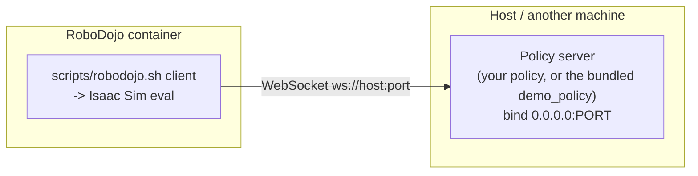

# Run RoboDojo in Docker

This image is the **RoboDojo simulation-evaluation side** — Isaac Sim 5.1,
IsaacLab, CuRobo, the RoboDojo Python stack, and the lightweight XPolicyLab client
used by `src/eval_client`. It contains **no policy, policy dependencies, or
checkpoints**: your **policy server runs outside the container** and the sim
client talks to it over the default WebSocket transport (`protocol: ws` in
`deploy.yml`), so one image can evaluate any policy.

- Base image: `nvidia/cuda:12.8.1-cudnn-devel-ubuntu22.04` (Ubuntu 22.04 + CUDA 12.8)
- Locked uv env inside the image: `/workspace/RoboDojo/.venv` (Python 3.11)
- Project root inside the container: `/workspace/RoboDojo`



## TL;DR

On a machine with an NVIDIA GPU (driver ≥ 570):

```bash
sudo bash docker/install_docker_nvidia.sh   # one-time: Docker + NVIDIA Container Toolkit
newgrp docker                               # (or log out/in) so docker works without sudo
bash docker/smoke_docker.sh run             # build the image, run a demo eval, assert PASS
```

The last command prints a per-phase `PASS/FAIL` table and writes a result file.
(Step 4 uses the bundled demo server, which needs the native locked uv
environment. Run `bash scripts/install.sh --install` first, or build the image
and jump to [step 5](#5-evaluate-your-own-policy).)

Everything below explains each step and how to plug in your own policy.

## 1. Prerequisites

| Need | Details |
| --- | --- |
| NVIDIA GPU + driver | Driver `570.x` or newer (required by CUDA 12.8). Check with `nvidia-smi`. |
| Disk space | The image is very large (~200 GB with all Isaac Sim extensions cached) and the build cache adds more — keep **300 GB+** free. |
| OS | Linux (tested on Ubuntu 22.04). |
| Assets | The RoboDojo `Assets/` directory on the host (downloaded by `scripts/init_assets.sh`); it is mounted at run time, not baked into the image. |

## 2. Install Docker + the NVIDIA Container Toolkit

If Docker and the toolkit already work with `--gpus all`, skip to step 3.

The bundled installer sets up Docker Engine, the NVIDIA Container Toolkit, the
`nvidia` runtime, and adds you to the `docker` group:

```bash
sudo bash docker/install_docker_nvidia.sh
newgrp docker      # or log out and back in
```

Verify the GPU is visible inside a container:

```bash
docker run --rm --gpus all nvidia/cuda:12.8.1-cudnn-devel-ubuntu22.04 nvidia-smi
```

You should see your GPU listed. If not, see [Troubleshooting](#6-troubleshooting).

> **China networks:** the installer auto-detects a restricted network and switches
> to TUNA/USTC apt mirrors + Docker Hub registry mirrors. Force it with
> `USE_CN_MIRRORS=1` (or disable with `USE_CN_MIRRORS=0`). Details in
> [Appendix B](#appendix-b-china-networks).

## 3. Build the image

From the repository root:

```bash
docker build -t robodojo:cuda12.8 .
```

- The **first build takes ~1 hour** (it downloads Isaac Sim and compiles CuRobo's
  CUDA kernels). Later builds reuse the layer cache and are fast.
- Headless RTX rendering works out of the box — the required libraries and a
  single Vulkan ICD are baked in (see [Appendix A](#appendix-a-configuration-reference)).
- `smoke_docker.sh run` (step 4) builds the image for you, so you can skip this
  step if you go straight there.

> **China networks:** `smoke_docker.sh` passes the right mirror `--build-arg`s
> automatically. For a manual build, see [Appendix B](#appendix-b-china-networks).

## 4. Run the demo evaluation

The fastest way to confirm the whole loop works is the bundled end-to-end check:

```bash
bash docker/smoke_docker.sh run
```

It runs, in order: GPU-in-container → image build → start the bundled `demo_policy`
server → a real container eval → assert the result file. A final table reports
each phase, and results land under `eval_result/`.

`demo_policy` is a zero-action dummy, so `success_rate: 0.0` is **expected** — the
point is that the pipeline renders, talks to the policy over WebSocket, steps the sim,
checks the reward, and writes a valid result:

```json
{ "success_rate": 0.0, "eval_time": 1, "score": 0.0, "details": { "0": { "success": false } } }
```

Watch progress live from a second terminal with `bash docker/smoke_docker.sh monitor`.

> **Note:** `smoke_docker.sh` launches the demo server **on the host** with
> `uv run --locked`. If you don't have the native `.venv` and only want Docker,
> skip this step and go to
> [step 5](#5-evaluate-your-own-policy), pointing the eval at any policy server you
> run yourself — the demo server is only a convenience.

## 5. Evaluate your own policy

The container is the simulator side; you run the **policy server** yourself and the
container connects over WebSocket (`protocol: ws`, same as `deploy.yml`).

**5.1 — Start your policy server** (outside the container). Bind it to `0.0.0.0`
(all interfaces), not `127.0.0.1`, so a container can reach it. See
[XPolicyLab](../XPolicyLab/README.md) for policy servers.

**5.2 — Run the eval** in the container, pointing `--policy-host`/`--policy-port`
at your server:

```bash
docker run --rm -it \
  --gpus all --network host --ipc host \
  -v "$PWD/Assets:/workspace/RoboDojo/Assets:ro" \
  -v "$PWD/Assets:$PWD/Assets:ro" \
  -v "$PWD/eval_result:/workspace/RoboDojo/eval_result" \
  -v "$HOME/.cache/warp:/root/.cache/warp" \
  -v "$HOME/.local/share/ov:/root/.local/share/ov" \
  -v "$HOME/.cache/ov:/root/.cache/ov" \
  robodojo:cuda12.8 \
  bash scripts/robodojo.sh client \
    --task stack_bowls \
    --policy-name GR00T_N17 \
    --policy-host 127.0.0.1 --policy-port 9999 \
    --ckpt <your_ckpt> --eval-num 1
```

Required client flags: `--task`, `--policy-name` (a directory under
`XPolicyLab/policy/`), `--policy-host`, `--policy-port`. Common options: `--ckpt`,
`--eval-num N` (or `native`), `--action-type` (default `ee`), `--env-gpu` (default
`0`). Add `--dry-run` to print the resolved command without launching anything.

**Mounts explained** (the last three are strongly recommended — they prevent slow
first starts):

| Mount | Why |
| --- | --- |
| `Assets → /workspace/RoboDojo/Assets:ro` | Robot/object/layout/material assets (not baked into the image). |
| `Assets → $PWD/Assets:ro` (same host path) | curobo configs bake **absolute host paths**; this second mount makes them resolve. See [Troubleshooting](#6-troubleshooting). |
| `eval_result → …/eval_result` | Persist results on the host. |
| `~/.cache/warp` | Reuse CuRobo's compiled kernels (else it recompiles for minutes on every start). |
| `~/.local/share/ov`, `~/.cache/ov` | Reuse Isaac Sim extensions/shaders (else Kit may stall pulling them). |

### Networking: where is your policy server?

| Policy server location | Run mode | `--policy-host` |
| --- | --- | --- |
| Same host as the container | `--network host` | `127.0.0.1` |
| Same host, bridge network | `--add-host=host.docker.internal:host-gateway` | `host.docker.internal` |
| Another machine | default networking | that machine's IP / hostname |

`localhost` inside a **bridge** container is the container itself, not the host —
this is the #1 reason "the simulator can't reach the policy server." The `client`
command checks that the policy server port is reachable before the WebSocket
handshake and prints guidance if the server is unreachable.

### Read-only S3-backed storage

When the host has the dedicated prefix mounted read-only, mount it into the
container read-only and provide a separate local scratch mount:

```bash
-v "$ROBODOJO_STORAGE_ROOT:/storage/robodojo:ro" \
-v "$ROBODOJO_LOCAL_SCRATCH_ROOT:/scratch/robodojo" \
-e ROBODOJO_STORAGE_ROOT=/storage/robodojo \
-e ROBODOJO_LOCAL_SCRATCH_ROOT=/scratch/robodojo \
-e ROBODOJO_S3_URI=s3://moonlake-harry-data/robodojo
```

The image includes AWS CLI for explicit publication. Supply credentials through
the runtime's protected AWS configuration, never through the image or source
tree. Active video streams and resume state remain under `/scratch/robodojo`;
completed runs publish to `runs/eval_result/RoboDojo/`. The container never
changes ownership or writes through `/storage/robodojo`.

## 6. Troubleshooting

**GPU not visible (`nvidia-smi` fails in a container).** The NVIDIA Container
Toolkit isn't active. Re-run `sudo bash docker/install_docker_nvidia.sh`, then
`sudo systemctl restart docker`.

**"Cannot reach the policy server."** Make sure the server binds `0.0.0.0`, and
match the networking table in step 5. Quick check inside the container:
`nc -vz <host> <port>`.

**First eval seems to hang for minutes (high CPU, low GPU).** A fresh container
recompiles CuRobo's Warp kernels and/or pulls Isaac Sim extensions. Mount the host
caches (step 5) so both are reused. `smoke_docker.sh` does this automatically.

**`ValueError: /abs/host/.../X5A.urdf is not a file`.** curobo robot configs
(`Assets/Robots/**/curobo.yml`, generated by
`utils/update_embodiment_config_path.py`) bake in absolute host paths. Mount
`Assets/` a second time at its original host path (step 5), both read-only.
`smoke_docker.sh` does this automatically.

**Tiled cameras hang on the first rendered frame.** Already fixed in the image
(see [Appendix A](#appendix-a-configuration-reference)); make sure you run with
`--gpus all`.

## Appendix A: Configuration reference

**`smoke_docker.sh` env toggles**

| Env | Effect |
| --- | --- |
| `ROBODOJO_SKIP_BUILD=1` | Reuse the existing image (skip the ~1 h build) — fast iteration. |
| `ROBODOJO_CN_MIRRORS=1/0` | Force China build mirrors on/off (default `auto`). |
| `ROBODOJO_SMOKE_TASK`, `ROBODOJO_SMOKE_PORT`, `ROBODOJO_SMOKE_POLICY`, … | Override task/port/policy/etc. (see the script header). |

**Volumes**

| Mount | Purpose |
| --- | --- |
| `-v "$PWD/Assets:/workspace/RoboDojo/Assets:ro"` | Assets (required at runtime, not baked). |
| `-v "$PWD/Assets:$PWD/Assets:ro"` | Resolve absolute host paths baked into curobo configs. |
| `-v "$PWD/eval_result:/workspace/RoboDojo/eval_result"` | Persist per-task eval artifacts on the host. |
| `-v "$HOME/.cache/warp:/root/.cache/warp"` (and `~/.local/share/ov`, `~/.cache/ov`, `~/.cache/nvidia`, `~/.nv`) | Isaac Sim / CuRobo caches — recommended for fast, offline-friendly starts. |
| `-e ROBODOJO_USD_ASSET_PREFIX=/path -v /host/usd:/path` | Point at a local Isaac Sim USD asset mirror (optional). |

**GPU selection.** `--gpus all` exposes every GPU; pin one with
`--gpus '"device=0"'`. Choose the Isaac Sim device with `--env-gpu ID`.

**Headless RTX (already handled).** Tasks render tiled cameras through Isaac Sim's
RTX path. The image bakes in `libxt6` (needed by Isaac Sim's MaterialX render
libs) and pins a **single Vulkan ICD** via `ENV VK_ICD_FILENAMES` /
`VK_DRIVER_FILES` (the toolkit also injects one at run time; two ICDs for the same
GPU wedge RTX init on the first frame). This requires `--gpus all` and
`NVIDIA_DRIVER_CAPABILITIES=all` (set by default).

**Build args.** `CUDA_IMAGE` (base image), plus the China mirrors `UBUNTU_MIRROR`
and `PYPI_INDEX_URL` (see the `Dockerfile`
header and [Appendix B](#appendix-b-china-networks)).

**Validate the image without a policy server**

```bash
docker run --rm --gpus all --network host --ipc host \
  -v "$PWD/Assets:/workspace/RoboDojo/Assets:ro" \
  robodojo:cuda12.8 \
  bash scripts/robodojo.sh doctor --skip-policy
```

## Appendix B: China networks

Everything auto-detects a restricted network; these are the manual knobs.

**Host install** (`install_docker_nvidia.sh`) — auto-uses TUNA (Docker CE) + USTC
(NVIDIA toolkit) apt mirrors and sets Docker Hub registry mirrors in
`/etc/docker/daemon.json`. Force with `USE_CN_MIRRORS=1`, disable with
`USE_CN_MIRRORS=0`.

**Image build** — `smoke_docker.sh` sets the mirror build-args when it detects (or
is told, via `ROBODOJO_CN_MIRRORS=1`) a China network. For a manual `docker build`:

```bash
docker build \
  --build-arg UBUNTU_MIRROR=mirrors.tuna.tsinghua.edu.cn \
  --build-arg PYPI_INDEX_URL=https://pypi.tuna.tsinghua.edu.cn/simple \
  -t robodojo:cuda12.8 .
```
